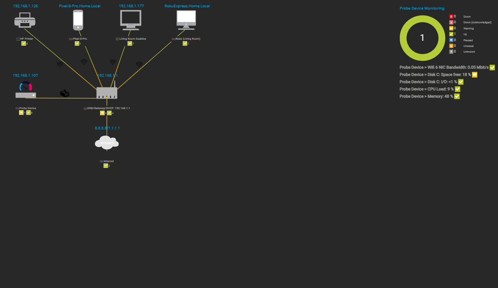
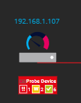
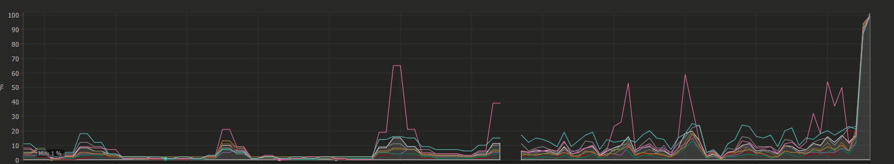
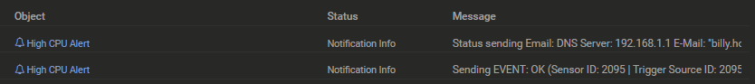
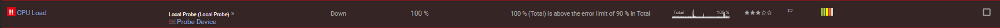

# 🏠 Home Network NOC Dashboard (PRTG)

## Overview
This project demonstrates a functional home Network Operations Center (NOC) built using **Paessler PRTG Network Monitor (Free Edition)**.

It visualizes and monitors a small home network including wired and wireless devices, with automated alerting and email notifications.  
This project was designed to practice real-world monitoring concepts for NOC and Tier-1 IT operations roles.

---

## Network Architecture
[Internet 🌐]
│ (External / Ping Check)
[Router/DHCP/Wi-Fi]
├── [Probe Device 💻] (Ethernet)
├── [Friend-PC 🖥️] (Ethernet)
├── [Printer 📠] (Wi-Fi)
├── [Pixel 📱] (Wi-Fi)
└── [Roku 📺] (Wi-Fi)

---

## Features
| Category | Description |
|-----------|-------------|
| **Monitoring Platform** | PRTG Network Monitor (Free Edition) |
| **Devices Monitored** | Router, Local Host, Friend-PC, Printer, Pixel 8 Pro, Roku |
| **Sensors** | WMI CPU Load, Memory, Disk, Ping, Bandwidth |
| **Alerts** | Email notification for CPU > 80% sustained 60s |
| **Dashboard (Map)** | Real-time topology showing Ethernet (blue) and Wi-Fi (green) |
| **Legend** | Custom HTML Connection Legend for visual clarity |
| **Scan Interval** | 30 seconds for active sensors |

---

## Screenshots
| View | Description |
|------|-------------|
|  | Final PRTG map view showing full network layout |
|  | Example alert state during simulated outage |
|  | CPU sensor graph with 80% threshold and limits |
|  | Sample automated alert email |
|  | CPU theshold alert logged |

---

## Key Learning Outcomes
- Configured PRTG sensors using **WMI, ICMP, and SNMP**
- Tuned **scanning intervals** and **threshold-based alerts**
- Created **automated email notifications** for CPU load monitoring
- Designed a clean **topology dashboard** differentiating Wi-Fi and Ethernet
- Practiced **real NOC-style monitoring** and troubleshooting workflows

---

## Tools Used
- **PRTG Network Monitor (Free Edition)**
- **Windows 10** host as PRTG server
- **Multiple client devices** for real monitoring
- **SMTP Email** for alert notifications

---

**Created by:** Billy Hodge  
**Goal:** Demonstrate real-world network monitoring and alert automation using enterprise-grade tools.
